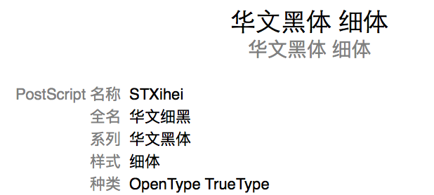

# DLUT_XeLaTeX_Template_For_Bachelor （本科版）

> 本模版修改自[dlutlatextemplate项目](https://code.google.com/archive/p/dlutlatextemplate/)由yuri_1985@163.com和dutfanwei@qq.com创建。

## 免责声明
**本模版并没有得到官方认证**，学校貌似也没有任何计划提供LaTex版本论文模版。虽然本模版与word版已经十分相近，也可以提交知网作审查，但目前还无法确认是否能通过最终的毕业审查。
仅提供给各位讨厌word排版的LaTex爱好者爽一爽 \^_\^。

## 目前测试环境
仅在macOS上使用TexPad调用XeLaTeX编译成功。强烈安利[TexPad](https://www.texpad.com)
（欢迎各位汇报编译情况）

## 主要解决的老模版问题
* 目录标题与目录主体之间的距离
* 目录小点之间的间距
* Mac下字体换成本科毕业论文模版中要求的字体
* XeLaTex生成的PDF拷贝文字乱码问题
* 各种微小的细节修复

## 已知问题
* 生成的PDF，目录与word版的目录不一样，主要体现于PDF的目录小点会算进字符数中，造成字符数居多的假象。建议删除目录页面来估算字符数。（估算PDF字符数的软件目前只发现windows下的福昕高级pdf编辑器可以统计，如果有人有Mac上的统计PDF字符数的软件推荐，请发我邮箱）
* 部分页面的排版与word版有些细微差距（待我打印出来细细比较调整一下间距）
* 页脚跟word版显示效果不太一样
* 有待挖掘。。。

## 使用提示
* 请根据自己电脑上对应字体的名称修改`./setup/fonts.tex`中

```
\setCJKfamilyfont{song}{SimSun}
\setCJKfamilyfont{hei}{STHeiti}
\setCJKfamilyfont{xhei}{STXihei} 
\setCJKfamilyfont{xkai}{STXingkaiSC-Bold}
```
后面的字体名称。（此名称为macOS中的字体名称，可以从字体册.app中查看字体名称，例如下图）否则编译回不通过。




* 格式修改在`./setup/format.tex`中修改，其中包括封面和摘要的具体排版。
* 封面内容在`./preface/cover.tex`中修改。
* main.tex中修改成分，比如添加章节（章节在`./body/`中），删去空白页等。
* 章节不够，直接复制几份chap0X.tex在main.tex中添加即可。
* bib在`./boby/reference.bib`下添加。
* 论文元素（例如表格什么的）可以按照`main参考.pdf`中的添加。
* 添加表格时推荐把`\toprule`和`\bottomrule`改成`\midrule`，这样与word版就相似了。

## BUG提交与本人联系方式
* 提交Bug请直接开issue
* 本人邮箱 heavenlykingwty@gmail.com


